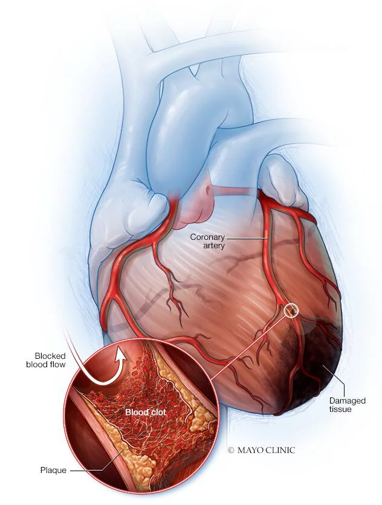

# Heart-Attack-Prediction

A heart attack (cardiovascular disease) happens when the passage of blood to the heart muscle is unexpectedly blocked. According to WHO figures, 17.9 million people die each year from a heart attack. According to the medical study, human lifestyle is the primary cause of this heart disease. Aside from that, there are other significant markers that indicate whether or not a person is at risk of suffering a heart attack.
 

About the heart - disease dataset:
The dataset is available on UC Irvine Machine Learning Repository .

In this notebook, we intend to analyze data related to cardiac features of patients from the "heart.csv" dataset. This dataset provides various information about patients, including age, gender, blood pressure, cholesterol levels, electrocardiographic (ECG) features, and more.

Dataset Information:
This dataset includes the following features:
age: The age of the patient.
sex: Gender of the patient (0: female, 1: male).
cp: Type of chest pain.
trestbps: Resting blood pressure.
chol: Serum cholesterol.
fbs: Fasting blood sugar > 120 mg/dl.
restecg: Resting electrocardiographic results.
thalach: Maximum heart rate achieved.
exang: Exercise induced angina.
oldpeak: ST depression induced by exercise relative to rest
